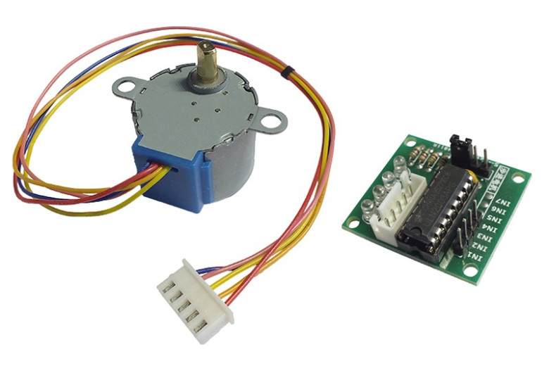
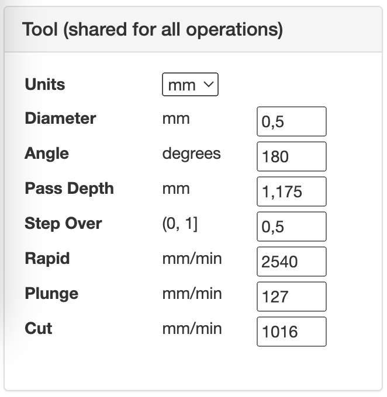
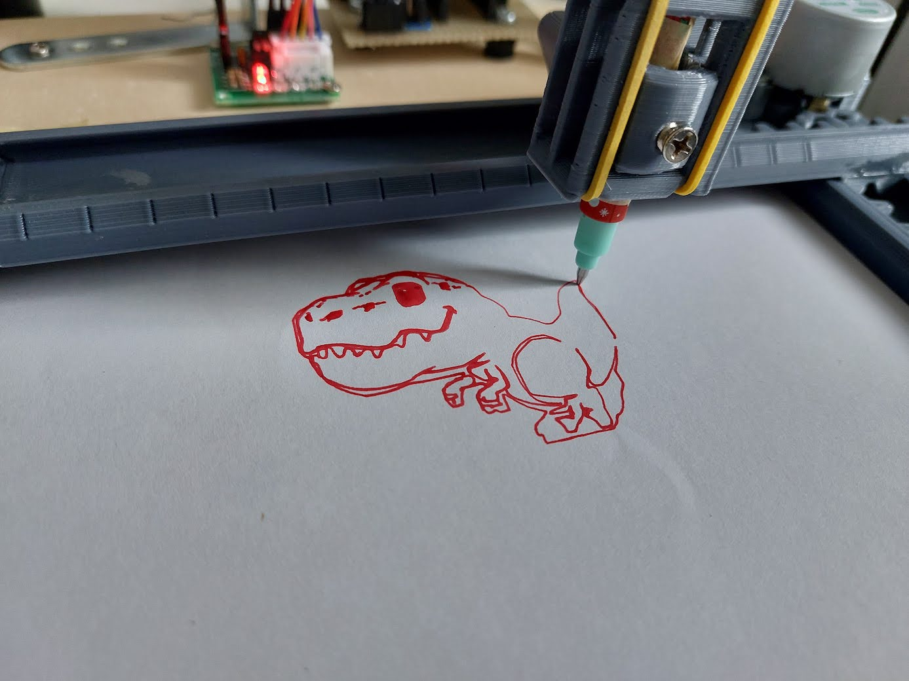
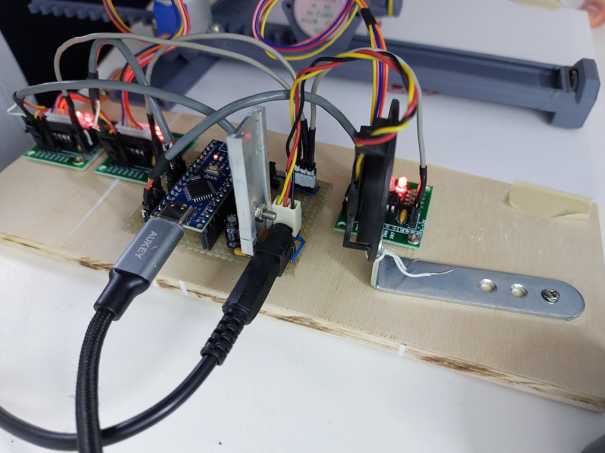
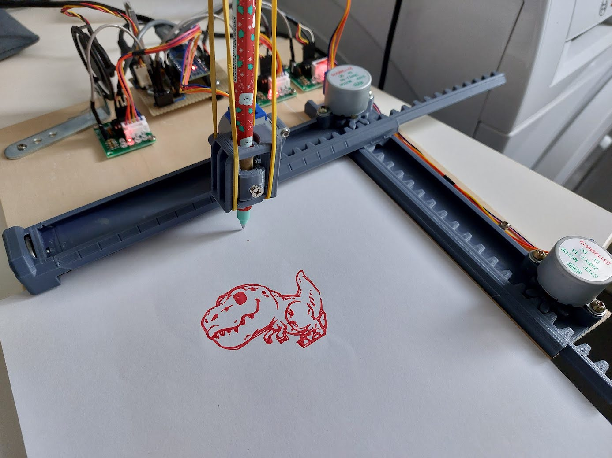
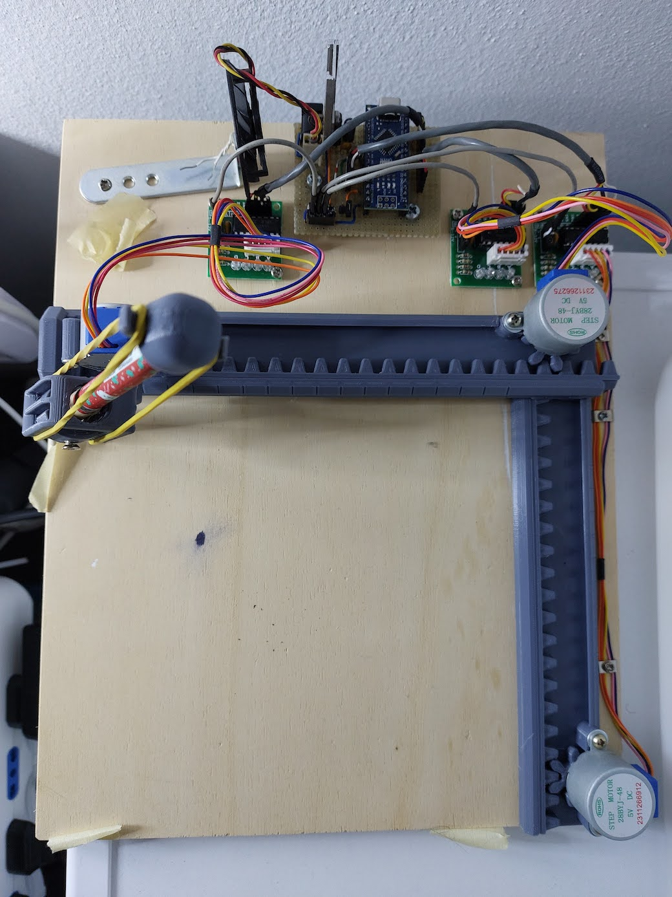

# CNC Plotter con Arduino

Progetto per realizzare un mini plotter cnc pilotato con arduino e motori passo passo 28byj-48

## Hardware

- 3 x motori passo passo 28byj-48 (io ho usato quelli a 5V)
- 3 x driver motori ULN2003 (solitamente venduti con i motori)

- 1 x arduino nano
- 1 x cuscinetto a sfera tipo 608
- 1 x LM7805 (o modulo stepdown per ottenere 5V)
- 1 x alimentatore 12V
- Superficie di legno su cui fissare il materiale
- Viti varie di recupero
- Assi e supporti stampati in 3D, vedi sezione dedicata
- Pazienza, ne serve abbastanza

## Componenti 3D

Progetto Thingiverse principale da cui sono partito: https://www.thingiverse.com/thing:4796222 
Ho clonato i file stl per comodità e li ho messi nella cartella stl di questo repo:
- _SpurGear.stl_: ingranaggio da montare sul motore stepper (ne servono 2)
- _bearing_center.stl_: cilindro che restringe il foro del cuscinetto a sfera di tipo 608 per usarlo con una vite da 2-3mm di diametro
- _pen_cap.stl_: cappello da mettere sulla penna con un paio di elastici per rendere morbido l'appoggio della penna sul foglio
- _pen_holder.stl_: supporto che gestisce la penna e si fissa sul motore per l'asse Z, la parte centrale deve risultare mobile e alloggia una vite per bloccare la penna in posizione
- _plate_01.stl_: binario per l'asse Y
- _plate_02.stl_: asse Y con barra dentata
- _plate_03.stl_: binario per l'asse X
- _plate_04.stl_: asse X con barra dentata
- _prop.stl_: supporto da incollare al binario per l'asse X
- _prop_bearing_608.stl_: alternativa da usare al prop.stl se si ha un cuscinetto di tipo 608

## Assemblaggio

Video del progetto originale che illustra i vari passaggi principali sia di assemblaggio che della messa in funzione: https://www.youtube.com/watch?v=WtUIBxfddjw
Schema di collegamento dei 3 motori driver:
| Axis       | Arduino      |ULN2003|ULN2003|28BYJ-48|
|:----------:|:------------:|:-----:|:-----:|:------:|
| X-Axis     |      D5      |IN1    |OUT1   |BLUE    |
|            |      D4      |IN2    |OUT2   |PINK    |
|            |      D3      |IN3    |OUT3   |YELLOW  |
|            |      D2      |IN4    |OUT4   |ORANGE  |
| Y-Axis     |      A0      |IN1    |OUT1   |BLUE    |
|            |      A1      |IN2    |OUT2   |PINK    |
|            |      A2      |IN3    |OUT3   |YELLOW  |
|            |      A3      |IN4    |OUT4   |ORANGE  |
| Z-Axis     |      D13     |IN1    |OUT1   |BLUE    |
|            |      D12     |IN2    |OUT2   |PINK    |
|            |      D9      |IN3    |OUT3   |YELLOW  |
|            |      D8      |IN4    |OUT4   |ORANGE  |
|            |              |       |+5V    |RED     |

## Software

 - **grbl Firmware per Arduino**: https://github.com/TGit-Tech/GRBL-28byj-48
Codice derivato dallo standard de facto per l'ambito cnc con Arduino **grbl**, consente di pilotare i 3 assi con i motori 28byj-48 ed i relativi driver più semplici dei normali stepper per cnc o stampanti 3d.
Copiare la cartella "grbl" che trovate per comodità anche in questo repo sotto il path ./lib-grbl nel path locale del PC con le librerie di ArduinoIDE (nel caso di macos /Users/nomeutente/Documents/Arduino/libraries/grbl).
 - **inkscape**: https://inkscape.org/
Famoso software open per manipolare e creare file vettoriali.
 - **jscut**: https://jscut.org/jscut.html
Consente di convertire file vettoriali svg contenenti path (eventuali font vanno convertiti in path prima con inkscape) in file gcode rispetto ai parametri della cnc configurati.
Nel path di questo repo (/jscut-settings/settings_20240105.jscut) c'è un esempio di impostazioni da caricare su jscut, nel caso è possible variare manualmente i settaggi, il pannello più importante si trova in masso a sinistra:

**Diameter** : sarebbe il diametro della fresa, nel nostro caso la larghezza del tratto disegnato dalla penna (più è fine più passate serviranno per disegnare)
**Pass Depth**: quanto dovrà andare in profondità la penna sull'asse z, si imposta un po' per tentativi
**Step Over**: percentuale di sovrapposizione delle varie passate, più il valore è basso più passate sovrapposte ci saranno, aumenterà di conseguenza il tempo e l'inchiostro usato.

- **UGS (Universal Gcode Sender)**: https://winder.github.io/ugs_website/
applicativo java based che consente di pilotare la cnc (il nostro arduino con firmware grbl) da PC via seriale (usb).
1. una volta aperto il programma selezionare la voce di menu "Machine" > "Setup Wizard"
2. Impostare i parametri di connessione alla porta seriale (firmware: GRBL; Port: nome della seriale a cui è collegato Arduino; baudrate: 115200), quindi cliccare "Connect"
3. Verificare la direzione degli assi X, Y, Z, ed eventualmente invertirla (io per la verità ho preferito invertire il connettore del driver su arduino per la X e la Y)
4. testare il movimento degli assi, misurando il reale spostamento rispetto al valore atteso ed inserire i parametri di step/mm calcolati dal programma (nel mio caso 72 step/mm sia per x che per y).
5. concludere il wizard senza modificare altro.

## Conclusioni

Alcune foto del risultato finale

